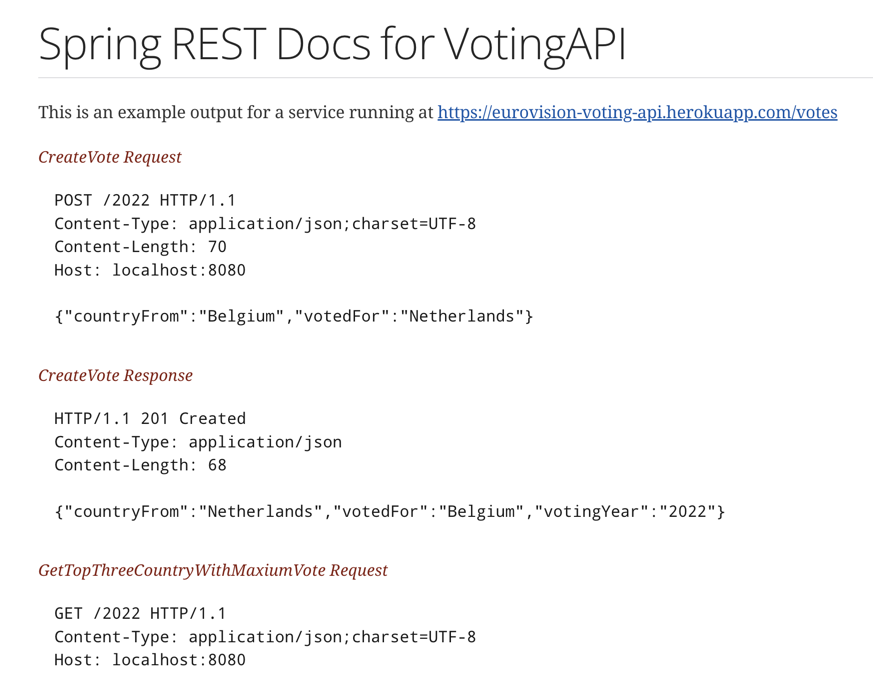

# eurovision-voting-api

Assumptions

* Database of our choice (For Simplicity selected H2 database)
* Build Database schema as per functional requirement 
* Build 3 client facing endpoints as per functional requirements
* Build Service and repository layers to fetch data and perform business logic
* Write tests for each layer (Web/service/repository)
* Add API documentation with Spring Rest Docs
* Add Docker file to create docker image and deploy in a kubernetes env
* Create an helm chart to deploy voting app (which contains K8s Manifests)

### Pre requisite installation

* Java 11
* Gradle
* kubernetes docker for desktop/minikube
* Helm

### Tech
* Java 11
* Springboot
* Spring-Data-Jpa
* Spring-Boot-Actuator
* Spring-rest-docs
* Lombok
* Gradle
* kubernetes
* Docker
* Helm


### Build

```
Build application which produces snapshot Jar

./gradlew build

Build docker image 

docker build -t pega/votingapi:v1 .
```

### Run

```
without Docker/helm -
./gradlew bootRun

With Docker/Helm

helm template charts
helm lint charts
helm install pegarelease charts
helm upgrade -i pegarelease . (incremental deployments)
```

## Postman

[](https://god.gw.postman.com/run-collection/685178-9a661b0a-87f7-4b9e-a6c2-67834043ed0a?action=collection%2Ffork&collection-url=entityId%3D685178-9a661b0a-87f7-4b9e-a6c2-67834043ed0a%26entityType%3Dcollection%26workspaceId%3De03b2ab3-447a-4a5f-8818-be163b36a6e7)


## Spring rest docs



